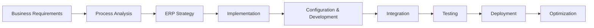

## Hi, I'm Obaid 👋

### ERP Project Manager | ERP Consultant | Digital Transformation

I work at the intersection of business process and technology, currently with **EasyCloud**, helping organizations plan and deliver ERP implementations end to end — from requirements gathering and process analysis through configuration, integration, and go-live support. My focus areas are **Odoo** and **ERPNext / Frappe**, with an emphasis on practical, well-documented implementations over one-off customization.

### What I Work With

- ERP Project Management
- ERP Implementation & Rollout Planning
- Odoo
- ERPNext / Frappe
- Business Process Analysis
- Requirements Gathering & Functional Consulting
- Workflow & Process Optimization
- Digital Transformation
- Technical & Functional Coordination

### Professional Focus

My role sits between business stakeholders and the technical team: translating operational requirements into functional specifications, coordinating implementation activities across departments, and making sure configuration and customization decisions actually solve the process problem they were meant to solve. In practice, that means as much time in requirements workshops and UAT sessions as in reviewing configuration and integration work.

### ERP Implementation Lifecycle

### Technology & Platforms

- Odoo
- ERPNext / Frappe
- Python
- JavaScript
- SQL
- Git / GitHub
- APIs & System Integrations

### Featured Work

Most of my ERP configuration and implementation work lives inside client environments and private company repositories rather than public open-source projects. The public repository below reflects ongoing personal technical practice:

- [JAVA_PRAC](https://github.com/obaidmasoom/JAVA_PRAC) — Java and JavaScript practice exercises

### Connect With Me

- [X / Twitter](https://twitter.com/ObaidMasoom)
- [GitHub](https://github.com/obaidmasoom)

